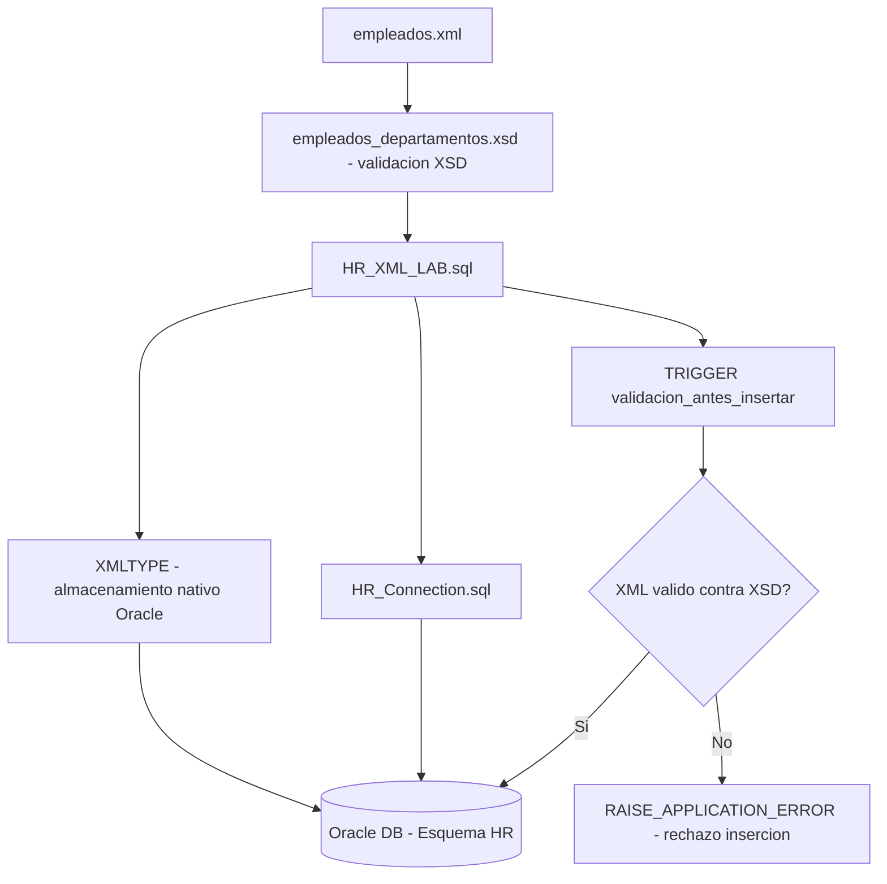

# 🧩 Laboratorio No. 1 — Almacenamiento y Validación de Ficheros XML en Oracle

## 📘 Descripción del Proyecto

---

Este proyecto tiene como objetivo **practicar la recuperación, almacenamiento y validación de información en formato XML dentro del Sistema Gestor de Base de Datos Oracle**.  

Se implementa un conjunto de sentencias SQL y PL/SQL que permiten generar un documento XML a partir del esquema **HR**, registrar su **esquema XSD** en la base de datos, y crear mecanismos de validación mediante **triggers** antes de la inserción de datos.

El ejercicio demuestra cómo Oracle puede **manipular estructuras XML de forma nativa**, garantizando la integridad de los datos mediante la combinación de tecnologías **SQL/XML**, **XML Schema**, y **XMLType**.

---

## 🧱 Estructura del Proyecto

El laboratorio está compuesto por los siguientes componentes:

| Elemento | Descripción |
|-----------|-------------|
| **HR_XML_LAB.sql** | Script principal con toda la implementación SQL y PL/SQL. Incluye la generación del XML, registro del esquema, creación del trigger y pruebas de inserción. |
| **Almacenamiento y validación de ficheros XML en Oracle + Alejandro De Mendoza.pdf** | Documento en formato PDF con la memoria explicativa del desarrollo, análisis, resultados y capturas del proceso completo. |
| **Capturas.zip** | Carpeta comprimida con evidencias visuales del proceso, ejecución en SQL Developer y resultados de consola. |

---

## ⚙️ Tecnologías Utilizadas

- **Oracle Database 11g / 12c**
- **SQL Developer**
- **PL/SQL**
- **XML / XSD**
- **Windows 10**

---

## 🔍 Descripción Técnica de la Implementación

El código desarrollado realiza las siguientes operaciones:

1. **Generación de XML**  
   Se extraen registros de las tablas `employees`, `departments` y `locations` del esquema **HR**, construyendo un documento XML estructurado mediante las funciones:
   - `XMLELEMENT`
   - `XMLAGG`
   - `XMLATTRIBUTES`
   - `XMLFOREST`
   - `XMLSERIALIZE`

2. **Registro del Esquema XML (XSD)**  
   Se crea y registra el esquema `empleados_departamentos.xsd` dentro de Oracle con la instrucción `DBMS_XMLSCHEMA.registerschema`.

3. **Creación de la Tabla XML**  
   Se define la tabla `empleados_xml` con una columna de tipo `XMLTYPE`, asociada al esquema XSD para garantizar la validación estructural.

4. **Creación del Trigger de Validación**  
   El trigger `trg_validar_xml` se activa antes de cada inserción o actualización.  
   - Verifica la presencia del elemento `<apellido>`.  
   - Impide el ingreso de datos que no cumplan con el formato definido.

5. **Inserciones de Prueba**  
   Se realizan inserciones válidas e inválidas para comprobar el correcto funcionamiento del trigger y la validación del XML.

---

## 🧠 Resultados y Validación

Durante la ejecución:
- Las **inserciones válidas** se almacenaron correctamente en la tabla `empleados_xml`.
- Las **inserciones inválidas** (sin apellido o con salario no numérico) fueron **rechazadas automáticamente** por el trigger, mostrando mensajes de error personalizados.

Este comportamiento confirma la eficacia del sistema de validación implementado.

---

## 🧩 Autor

**👨‍💻 Alejandro De Mendoza**  
Ingeniería Informática  
Especialización en Inteligencia Artificial  
📍 Bogotá, Colombia  

---

## 📁 Instrucciones para Ejecución

1. Conectarse al esquema `HR` en Oracle.
2. Ejecutar el archivo `HR_XML_LAB.sql` en **SQL Developer**.
3. Observar en consola la generación del XML.
4. Verificar el registro del esquema XSD.
5. Ejecutar las inserciones de prueba para validar el trigger.
6. Consultar los registros en la tabla `empleados_xml`.

---

## 📜 Licencia

Este proyecto fue desarrollado con fines **académicos**.  
Se permite su uso, distribución y adaptación siempre que se otorgue el crédito correspondiente al autor original.

---

## Arquitectura

## Autor

**Alejandro De Mendoza**  
Ingeniero Informático · Especialista en IA · Especialista en Ingeniería de Software · Máster en Arquitectura de Software

